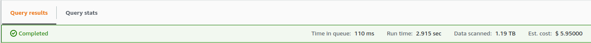

AWS Athena Cost Estimator
-------------------------
This [Tampermonkey](https://www.tampermonkey.net/) script adds an estimated cost amount in USD to the query results stats bar:

Athena charges [per TB data scanned per query](https://aws.amazon.com/athena/pricing/), with a minimum of 10 MB per query.

This script uses the AWS regional pricing as of December 13, 2022.

Install
-------
1. Install the Tampermonkey Chrome extension.
2. Open the Athena Cost Estimator [source code](https://github.com/dnmfarrell/tampermonkey-athena-cost-estimator/raw/master/athenaCostEstimator.user.js) and click "install".
3. The "Est. cost" stat will automatically appear when running Athena queries on AWS console.

License
-------
Copyright 2022 David Farrell

Permission is hereby granted, free of charge, to any person obtaining a copy of this software and associated documentation files (the "Software"), to deal in the Software without restriction, including without limitation the rights to use, copy, modify, merge, publish, distribute, sublicense, and/or sell copies of the Software, and to permit persons to whom the Software is furnished to do so, subject to the following conditions:

The above copyright notice and this permission notice shall be included in all copies or substantial portions of the Software.

THE SOFTWARE IS PROVIDED "AS IS", WITHOUT WARRANTY OF ANY KIND, EXPRESS OR IMPLIED, INCLUDING BUT NOT LIMITED TO THE WARRANTIES OF MERCHANTABILITY, FITNESS FOR A PARTICULAR PURPOSE AND NONINFRINGEMENT. IN NO EVENT SHALL THE AUTHORS OR COPYRIGHT HOLDERS BE LIABLE FOR ANY CLAIM, DAMAGES OR OTHER LIABILITY, WHETHER IN AN ACTION OF CONTRACT, TORT OR OTHERWISE, ARISING FROM, OUT OF OR IN CONNECTION WITH THE SOFTWARE OR THE USE OR OTHER DEALINGS IN THE SOFTWARE.
